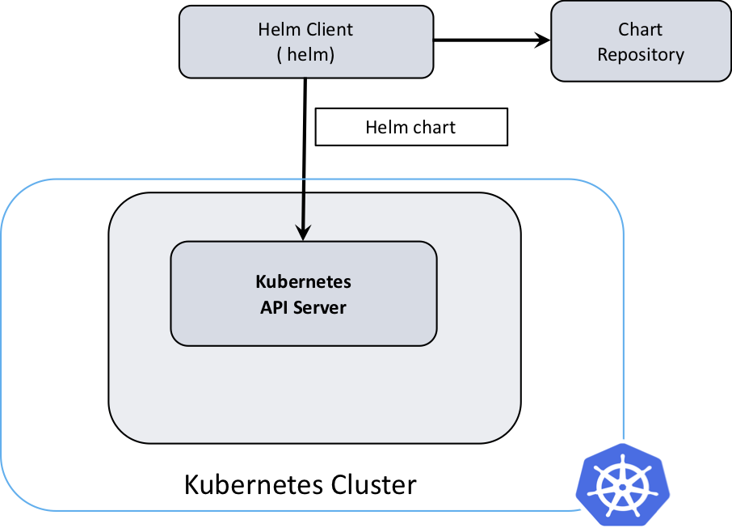

# Helm 101

[Helm](https://helm.sh/) is often described as the Kubernetes application package manager. So, what does Helm give you over using `kubectl` directly?

## Objectives

These labs provide an insight on the advantages of using Helm over using Kubernetes directly through `kubectl`. In several of the labs there are two scenarios. The first scenario gives an example of how to perform the task using `kubectl`, the second scenario, using `helm`. When you complete all the labs, you'll:

* Understand the core concepts of Helm
* Understand the advantages of deployment using Helm over Kubernetes directly, looking at:
  * Application management
  * Updates
  * Configuration
  * Revision management
  * Repositories and chart sharing

## Prerequisites

* Have a running Kubernetes cluster. See the [IBM Cloud Kubernetes Service](https://cloud.ibm.com/docs/containers/cs_tutorials.html#cs_cluster_tutorial) or [Kubernetes Getting Started Guide](https://kubernetes.io/docs/setup/) for details about creating a cluster.
* Have Helm installed and initialized with the Kubernetes cluster. See [Installing Helm on IBM Cloud Kubernetes Service](Lab0/README.md) or the [Helm Quickstart Guide](https://helm.sh/docs/intro/quickstart/) for getting started with Helm.

## Helm Overview

Helm is a tool that streamlines installation and management of Kubernetes applications. It uses a packaging format called "charts", which are a collection of files that describe Kubernetes resources. It can run anywhere (laptop, CI/CD, etc.) and is available for various operating systems, like OSX, Linux and Windows.

Helm 3 pivoted from the [Helm 2 client-server architecture](https://github.com/IBM/helm101/tree/helm-v2/tutorial#helm-overview) to a client architecture. The client is still called `helm` and, there is an improved  Go library which encapsulates the Helm logic so that it can be leveraged by different clients. The client is a CLI which users interact with to perform different operations like install/upgrade/delete etc. The client interacts with the Kubernetes API server and the chart repository. It renders Helm template files into Kubernetes manifest files which it uses to perform operations on the Kubernetes cluster via the Kubernetes API. See the [Helm Architecture](https://helm.sh/docs/topics/architecture/) for more details.

A [chart](https://helm.sh/docs/topics/charts/) is organized as a collection of files inside of a directory where the directory name is the name of the chart. It contains template YAML files which facilitates providing configuration values at runtime and eliminates the need of modifying YAML files. These templates provide programming logic as they are based on the [Go template language](https://golang.org/pkg/text/template/), functions from the [Sprig lib](https://github.com/Masterminds/sprig) and other [specialized functions](https://helm.sh/docs/howto/charts_tips_and_tricks/#know-your-template-functions).

The chart repository is a location where packaged charts can be stored and shared. This is akin to the image repository in Docker. Refer to [The Chart Repository Guide](https://helm.sh/docs/topics/chart_repository/) for more details.

## Helm Abstractions

Helm terms:

* Chart - It contains all of the resource definitions necessary to run an application, tool, or service inside of a Kubernetes cluster. A chart is basically a package of pre-configured Kubernetes resources.
* Config - Contains configuration information that can be merged into a packaged chart to create a releasable object.
* helm - Helm client. It renders charts into manifest files. It interacts directly with the [Kubernetes API](https://kubernetes.io/docs/concepts/overview/kubernetes-api/) server to install, upgrade, query, and remove Kubernetes resources.
* Release - An instance of a chart running in a Kubernetes cluster.
* Repository - Place where charts reside and can be shared with others.

To get started, head on over to [Lab 1](Lab1/README.md).
